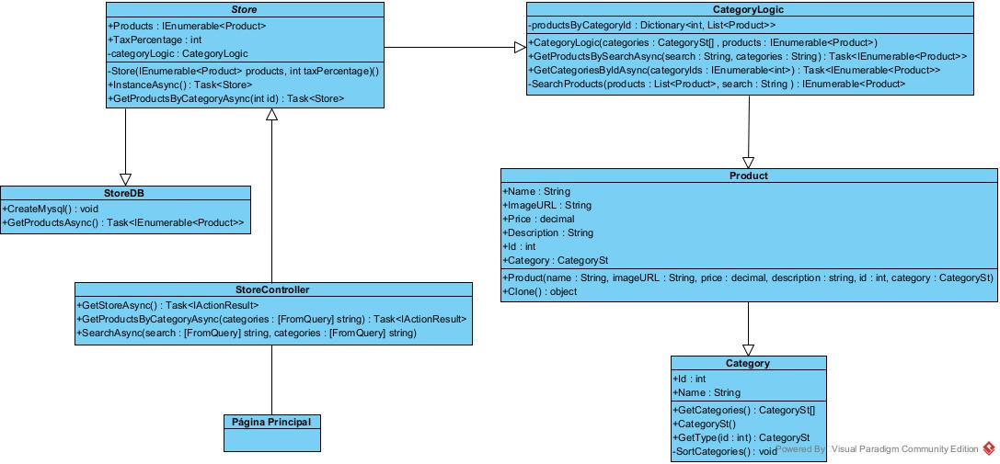
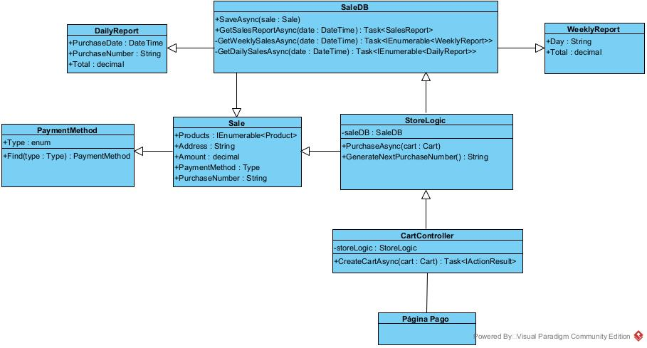
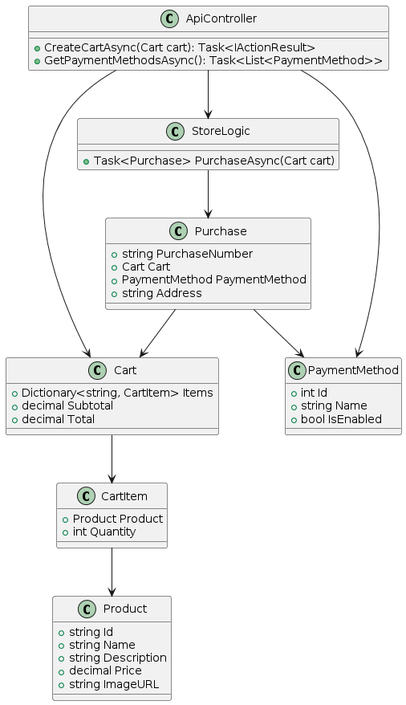
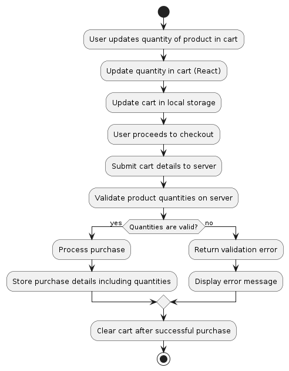

# Web Page
**Developer:** Aarón Chacón Céspedes
## Diagramas
### Diagrama de la página principal


### Diagrama de la página de pago


### Diagrama de la página de reportes


## Diagrama de Paquetes


## Diagrama de Actividad


## Diagrama del WebSocket


## Diagrama de clases del Proyecto


## Diagrama de actividad del Carrito


## Diagrama de actividad del Pago


## Seguridad
### Autenticación y Autorización
La autenticación y autorización se manejan mediante JWT (JSON Web Tokens). El endpoint de autenticación se encuentra en el controlador `AuthController`, el cual genera un token JWT al validar las credenciales del usuario. Este token incluye roles y permisos, permitiendo el control de acceso basado en roles para diferentes partes de la aplicación.

El token JWT se valida en cada solicitud a través de middleware configurado en `Program.cs`, asegurando que solo usuarios autenticados puedan acceder a ciertos endpoints. Además, se utiliza el esquema de autorización de `Bearer` con `JwtBearerDefaults.AuthenticationScheme`.

### Configuración del JWT
En el archivo `Program.cs` se configura el esquema de autenticación JWT con las siguientes opciones:
```
builder.Services.AddAuthentication(JwtBearerDefaults.AuthenticationScheme)
    .AddJwtBearer(options =>
    {
        options.TokenValidationParameters = new TokenValidationParameters
        {
            ValidateIssuer = true,
            ValidateAudience = true,
            ValidateLifetime = true,
            ValidateIssuerSigningKey = true,
            ValidIssuer = "http://localhost:5087",
            ValidAudience = "http://localhost:5087",
            IssuerSigningKey = new SymmetricSecurityKey(Encoding.UTF8.GetBytes("TheSecretKeyNeedsToBePrettyLongSoWeNeedToAddSomeCharsHere"))
        };
    });
```

### Autorización basada en roles
El rol del usuario se extrae del token JWT y se utiliza para controlar el acceso a ciertas partes de la aplicación. Por ejemplo, solo los usuarios con el rol `Admin` pueden acceder a la interfaz de administración.

## Caché
### Caché de productos
Para mejorar la eficiencia y reducir las solicitudes a la base de datos, se implementa un mecanismo de caché para los productos en la tienda. Los productos y categorías se cargan inicialmente desde la base de datos y se almacenan en el almacenamiento local (`localStorage`) del navegador.

### Implementación de la caché
En la página principal de la tienda (`Home`), se comprueba si hay datos almacenados en `localStorage`:
```
const storeData = JSON.parse(localStorage.getItem('store') || '{}');
if (storeData.products) {
    setProductList(storeData.products);
    setCategories(storeData.categories || []);
} else {
    const response = await fetch(URL + `/api/store`);
    const data = await response.json();
    setProductList(data.store.products);
    setCategories(data.categories);
    localStorage.setItem('store', JSON.stringify(data.store));
}
```

## Buscador de productos
El buscador de productos permite a los usuarios buscar productos por nombre, descripción y precio. Utiliza una búsqueda binaria optimizada para encontrar coincidencias en la lista de productos.

### Lógica de búsqueda
En `CategoryLogic.cs`, se implementa la lógica de búsqueda:
```
public async Task<IEnumerable<Product>> GetProductsBySearchAsync(string search, string categories)
{
    List<Product> matchingProducts = new List<Product>();
    List<int> categoryIdsList = categories?.Split(',').Select(int.Parse).ToList();
    if (categoryIdsList == null || !categoryIdsList.Any())
    {
        foreach (var id in productsByCategoryId)
        {
            matchingProducts.AddRange(SearchProducts(id.Value, search));
        }
    }
    else
    {
        foreach (var categoryId in categoryIdsList)
        {
            if (productsByCategoryId.TryGetValue(categoryId, out List<Product> categoryProducts))
            {
                matchingProducts.AddRange(SearchProducts(categoryProducts, search));
            }
        }
    }
    return matchingProducts;
}
```

## Reportes de venta
La aplicación proporciona reportes de ventas diarias y semanales. Los reportes se obtienen de la base de datos y se presentan en la interfaz de administración.

### Implementación de reportes
En el controlador `SaleController`, se implementa un endpoint para obtener los reportes de ventas:
```
[HttpGet]
public async Task<IActionResult> GetReportAsync([FromQuery] DateTime date)
{
    if (date == DateTime.MinValue)
    {
        return BadRequest("Date parameter is required.");
    }
    if (date > DateTime.Now)
    {
        return BadRequest("Date cannot be in the future.");
    }
    SaleDB saleDB = new SaleDB();
    SalesReport salesReport = saleDB.GetSalesReport(date);
    return Ok(salesReport);
}
```
